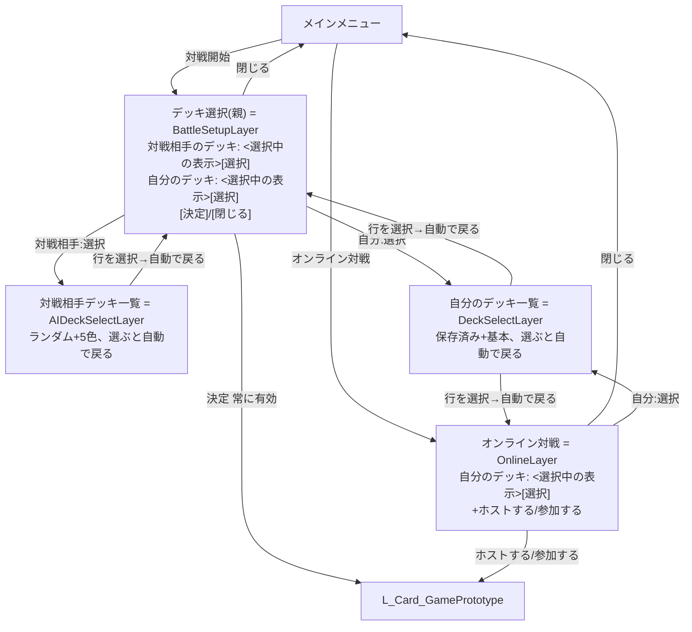

# カードゲーム アーキテクチャ設計書

Unreal Engine 5.8上のカードゲーム実装(`CardGame/Source/CardGame/`)の設計を
まとめた恒久ドキュメント。過去の一時的な作業手順書(リファクタリング計画・
機能実装計画)は完了後に削除する運用のため、そこで確定した設計のうち今後も
価値のある部分はここに集約している。

## ドキュメント構成

`docs/`配下は主に次の5つの観点でまとめている。同じ内容を複数箇所に書かない
方針のため、各ドキュメントは基本的にそれぞれの観点の**唯一の定義元**になる。

| 観点 | ドキュメント |
|---|---|
| ゲームのルール | [game-rules-minimum.md](game-rules-minimum.md)(現行実装の仕様一式) |
| カードの効果 | [next-ruleset-cards-v1.md](next-ruleset-cards-v1.md)(5色78種+無色24種の全カードリスト) |
| ゲームの世界観 | [カードゲーム 世界観・フレーバー設定.md](<カードゲーム 世界観・フレーバー設定.md>)(舞台設定・色ごとの国・カードのフレーバーテキスト例) |
| ゲームの演出 | [presentation.md](presentation.md)(攻撃/カードプレイ/勝敗の演出、行動ログ等のHUDフィードバック) |
| ゲームのキーワード | [keywords.md](keywords.md)(疾駆/分身/庇護/断罪/変貌/先物/増強/生け贄の定義一覧) |
| バランス検証の手順 | [simulation-guide.md](simulation-guide.md)(自己対戦シミュレーションの実行コマンド・ログの読み方) |
| パッケージ化の手順 | [packaging-guide.md](packaging-guide.md)(配布用ビルドの作り方、注意点、動作確認手順) |

上記は「今のゲームがどうなっているか」を表す現在地のドキュメント。ルール設計の
壁打ち経緯(next-ruleset-design.md)とカードバランス調整の実測ログ
(next-ruleset-simulation-v1.md)は、内容が上記の現在地ドキュメントへ反映済みで
読み返す機会も無くなったため削除した。[initial-cards-v0.1.md](initial-cards-v0.1.md)
だけは旧ルール(初期デッキ12枚時代)のカード24種が今も「無色」カードプールの
元データとして`BuildLegacyCards()`から参照される現役データのため残している。

その他、開発環境固有の技術メモは以下を参照。

- 実装上の技術的な制約・落とし穴(UMGのRebuildWidgetの罠、Python自動化の限界等):
  [automation-notes.md](automation-notes.md)
- オンライン対戦の設計: [online-play-design.md](online-play-design.md)
  (実装済みの技術的判断は本ドキュメントの「オンライン対戦移行時の実装メモ」を
  参照。実装計画だった`online-play-plan.md`は完了に伴い削除し、価値のある内容は
  ここへ移した)

## 全体構成

UIも含めて全てC++で実装している(UMG WidgetTreeがPython Editor Scripting APIから
編集できないため。詳細は automation-notes.md)。BlueprintクラスはC++クラスを親に
持つ薄いラッパー(`BP_CG_GameMode`/`GameState`/`PlayerState`、
`Content/CardGame/Core/`)のみ残っており、ロジックは全てC++側にある。

### レベルと画面遷移

3つのレベルを `UGameplayStatics::OpenLevel` で行き来する構成(ウィジェット切り替え
ではない)。

```
L_Lobby ──(デッキ構築)──> L_DeckBuilder ──(保存)──> L_Lobby ──(対戦開始→デッキ選択→決定)──> L_Card_GamePrototype ──(勝敗確定後、ロビーへ戻る)──> L_Lobby
```

| レベル | GameMode | HUD | 役割 |
|---|---|---|---|
| `L_Lobby` | `ACGLobbyGameMode` | `UCGLobbyHUD` | 「デッキ構築」「対戦開始」「カード図鑑」「遊び方」「オンライン対戦」。対戦開始/カード図鑑/遊び方/オンライン対戦はレベル遷移を伴わない全画面モーダルレイヤー(下記) |
| `L_DeckBuilder` | `ACGDeckBuilderGameMode` | `UCGDeckBuilderHUD` | 78種(次期ルール)から25枚(同名カード3枚まで重複可)を選ぶデッキ編成画面 |
| `L_Card_GamePrototype` | `ACGGameMode` | `UCGGameHUD` | 対人1vsAI1の対戦本編(オフライン/オンライン共通) |

`ACGLobbyGameMode`/`ACGDeckBuilderGameMode` は対戦ロジックを持たない軽量GameMode
で、`BeginPlay`から1フレーム遅延させてHUDを`AddToViewport`する点以外はほぼ同じ
構成(`SetupHUD`+`FTimerHandle`)。

#### ロビーのモーダル構成(デッキ選択の画面遷移)

「CPUと対戦するときに相手のデッキを選べるようにしてほしい。ただし対戦ボタンを
押した後に相手と自分のデッキを選択してから対戦が開始されるようにしてほしい」
というフィードバックへの対応。単純に一覧を並べるのではなく、**親画面(情報表示)
→一覧画面(選択)→親画面へ自動的に戻る**という一段掘り下げ(drill-down)構成に
なっている(「デッキ選択画面には選択されているデッキの情報だけわかるように
してほしい」という追加フィードバックへの対応)。



- `BattleSetupLayer`(デッキ選択(親))と`OnlineLayer`は、選ばれているデッキの
  **情報表示(名前+枚数)のみ**を持ち、一覧そのものは出さない。「選択」ボタンで
  対応する一覧画面(`AIDeckSelectLayer`/`DeckSelectLayer`)へ遷移する。
- `AIDeckSelectLayer`/`DeckSelectLayer`(一覧画面)自体には「閉じる」を置かない。
  行を選ぶと`GameInstance`へ即座に反映し、そのままこの画面を閉じて呼び出し元へ
  自動的に戻る(離脱手段は選ぶことのみ)。
- `DeckSelectLayer`(自分のデッキ一覧)は`BattleSetupLayer`と`OnlineLayer`の
  **両方から開かれる共通画面**。`UCGLobbyHUD::PendingReturnLayer`(一覧画面を
  開く直前にセットする「戻り先」)で、選択後にどちらへ戻るかを決める。
- 「決定」ボタン(`BattleSetupLayer`)は常に有効。一度も操作しなくても
  `GameInstance`の現在値(前回の選択、既定はランダム/直近のアクティブデッキ)を
  そのまま使って`OpenLevel(L_Card_GamePrototype)`する。

### デッキの永続化

レベルをまたいで生存させる必要があるデータ(プレイヤーが選んだデッキ)は
`UGameInstance`派生の `UCGGameInstance` が保持する(GameMode/GameStateはレベル
遷移で破棄されるため)。

- `UCGGameInstance::SavedDecks`(`TArray<FCGSavedDeck>`、名前+カードID)が
  複数デッキを保持する。`PlayerDeckCardIds`は「現在アクティブなデッキの中身」
  (`ACGGameMode::InitializeMatch()`がここから読み取る)、`ActiveDeckName`は
  `SavedDecks`内のどれがアクティブかを指す名前。`SaveDeckAs()`(保存/上書き)・
  `SelectSavedDeck()`(一覧から選択)・`DeleteSavedDeck()`(削除)の3操作は
  いずれもアクティブなデッキとディスク保存(`PersistSavedDecksToDisk()`)を
  同時に更新する。`UCGDeckBuilderHUD`のデッキ構築画面と`UCGLobbyHUD`のデッキ
  選択一覧(下記「レベルと画面遷移」)の両方がこの3操作を通して`SavedDecks`を
  操作する。
- `UCGDeckSaveGame`(`USaveGame`派生): ディスク保存用。`SavedDecks`(全デッキ)+
  `ActiveDeckName`をまとめて1つのセーブスロットへ保存し、
  `UCGGameInstance::Init()`で起動時に読み込む。1件も無い(初回起動、または
  25枚固定ルールに反する壊れたデータを除外した結果0件)場合はスターター
  デッキを自動生成する。
- `UCGGameInstance::SelectedAIOpponentColor`(`ECGColor`): 対戦相手(AI、Side1)が
  使うデッキの色(「CPUと対戦するときに相手のデッキを選べるようにしてほしい」
  というフィードバックへの対応)。「対戦開始」から開く「デッキ選択(親)」画面
  (`BattleSetupLayer`)の「対戦相手のデッキ」→「選択」から一覧画面
  (`AIDeckSelectLayer`、ランダム+5色の固定6択)を開いて選ぶと、その場で
  直接この値が更新される(上記「ロビーのモーダル構成」参照)。既定値
  `ECGColor::None`は「ランダム」を表し、`ACGGameMode::InitializeMatch()`は
  これが`None`のときだけ以前と同じ5色ランダム抽選にフォールバックする。
  `PlayerDeckCardIds`と違いディスクへは永続化しない(アプリ再起動のたびに
  ランダムへ戻ってよいという判断)。

## 対戦ロジックのクラス責務

| クラス | 責務 |
|---|---|
| `ACGGameMode` | 対戦進行の中核。マッチ初期化、ターン進行、`RequestPlayCard`/`RequestBuyCard`/`RequestAttack`/`RequestEndTurn`の受付、勝敗判定。手番がAI側になったら`UCGAIOpponent`を呼ぶだけで、AIの思考ロジック自体は持たない |
| `ACGGameState` | 対戦全体の公開状態(ターン数、フェーズ、勝者、マーケット6枠`MarketSlots`(各枠が出どころの山札を保持。下記「マーケット」参照)、両陣営の`ACGPlayerState`への参照、選択待ち状態`PendingChoice`) |
| `ACGPlayerState` | 片側プレイヤーの全データ(HP/マナ/手札/デッキ/捨て札/場/発動中の色`ActiveColors`)と、ドロー・プレイ・購入・攻撃・死亡処理・カード効果ディスパッチ・変貌判定 |
| `UCGAIOpponent` | AI側(Side 1固定)の意思決定ロジック。`RunTurn()`1回で購入→プレイ→攻撃→EndTurnまで同期的に完結させる。`ACGGameMode`の公開APIのみを呼ぶため、進行ルール自体はGameMode側に残る |
| `UCGCardDatabase` | カードマスタ(静的データ)を保持する`BlueprintFunctionLibrary`。デッキ構築/カード図鑑には次期ルール78種のみを返す`GetBuildableCards()`を使い、`FindCard()`/`GetAllCardIds()`は旧24種(フォールバック)を含む`GetAllCards()`(102種)を参照する |

`ACGPlayerState`と`UCGAIOpponent`を分けているのは、AIをより賢くする・難易度を
分けるといった将来の拡張でGameMode本体を肥大化させないため。

### 場のユニットの状態管理

`FCGBoardUnit`(`CGTypes.h`)1構造体に、場のユニット1体分の状態
(`CardId`/`Atk`/`Hp`/`bCanAttack`/`bHasGuard`、次期ルールの変貌用に
`OriginalCardId`(変貌前のCardId、空なら変貌していない)/`TransformProgress`
(変貌条件の進行度、汎用カウンタ)も追加済み)をまとめている。新しい状態
(毒/沈黙等)を足す場合はこの構造体にフィールドを追加する。

### カード効果ディスパッチ(EffectId → ハンドラ関数)

`FCGCardDef::EffectId`(FName)を経由するテーブル駆動方式。カードが増えるほど
分岐が際限なく伸びるif/elseの塊を避けるための設計。実装は`CGPlayerState.cpp`の
無名namespace内。

- ハンドラは4種類、それぞれ `EffectId -> 関数ポインタ` の `TMap` で管理:
  - `FSpellEffectHandler`(`GetSpellEffectHandlers()`): Spellカードをプレイした
    ときの効果(例: `Handle_OnPlayDamageTarget`)
  - `FUnitOnPlayEffectHandler`(`GetUnitOnPlayEffectHandlers()`): Unitが場に
    出た瞬間の効果(例: `Handle_ScoutTop1`)
  - `FUnitOnDeathEffectHandler`(`GetUnitOnDeathEffectHandlers()`): Unitが
    死亡した瞬間の効果(例: `Handle_OnDeathDraw`)
  - `FEndTurnAuraEffectHandler`(`GetEndTurnAuraEffectHandlers()`): 場にいる間
    ずっと有効な常在効果のうち、ターン終了時に判定するもの
    (例: `Handle_OnBuyEndTurnDiscardDraw`)。常在効果全般は
    `ACGPlayerState::HasBoardUnitWithEffect(EffectId)`で都度判定している
    (例: 結晶の谺を読む射手・荒野の物々交換人・第六界を記す学者は攻撃/購入/Spell発動のタイミングで
    直接`HasBoardUnitWithEffect`を呼んでいる)
- ハンドラは全て状態を持たない静的関数(関数ポインタ)なので、Side0/Side1どちらの
  `ACGPlayerState`インスタンスに対しても同じテーブルを使い回せる。
- 未登録のEffectId(将来ここに新しいカードタイプ用の値を置いた場合等)は何も
  起きない(テーブルに見つからなければ無視するだけ)。
- 例外として**変貌(紫、次期ルール)はこのテーブルに乗らない**。変貌先/条件は
  `FCGCardDef::TransformTargetCardId`/`TransformConditionId`/`TransformConditionValue`
  というデータのみで表現し、`CGTransformConditionId`(`CGTypes.h`)の6種類の
  条件を`ACGPlayerState`側(`ApplyTransformIfConditionMet`/`OnTurnStartTransformTick`/
  `CheckAllTransforms`)が汎用的に判定する。カードごとにHandle_XXX関数を書く
  必要がなく、カードを増やす場合もデータ追加のみで済む。**分身(緑)も同じ
  考え方**で、`FCGCardDef::CloneConditionId`/`CloneConditionValue`と
  `CGCloneConditionId`(`CGTypes.h`)を`ApplyCloneIfConditionMet`/`CheckAllClones`
  が汎用的に判定する(コピーが持つ登場時効果自体は通常のディスパッチ
  テーブル`GetUnitOnPlayEffectHandlers()`をそのまま再利用する)。
- 同様に、ターン開始時に判定する常在効果は`ACGPlayerState::ApplyOnTurnStartAuraEffects()`
  が場のUnitを走査してEffectId(`OnTurnStartDraw`等)で判定する、
  `FEndTurnAuraEffectHandler`と対になる仕組み(`ACGGameMode::StartTurn()`から呼ぶ)。

**新しいカード効果を追加する手順**:
1. `CGTypes.h`の`CGEffectId`namespaceに定数を1行追加する。
2. `CGPlayerState.cpp`に`Handle_XXX`関数を1つ書く(効果の種類に応じて4種類の
   シグネチャのいずれかに合わせる)。
3. 対応する`Get*Handlers()`のテーブルに1行追加する。
4. `CGCardDatabase.cpp`の`MakeCard()`呼び出しで、対象カードの`EffectId`に
   その定数を指定する。

### カードデータモデル(`FCGCardDef`, `CGTypes.h`)

| フィールド | 用途 |
|---|---|
| `CardId`/`CardName`/`CardType`/`Cost`/`Atk`/`Hp` | 基本情報 |
| `Color` | 次期ルールの色(`ECGColor`、Red/Orange/Green/Blue/Purple)。旧24種は`None`のまま(game-rules-minimum.md「色ガイド」参照) |
| `Description` | 効果テキスト(UI表示用) |
| `Tribe` | 部族/系統(例: 戦士、アンデッド)。**将来のシナジー効果実装を見込んだ予約フィールド**で、現状は参照するロジックが無く、UI表示と一部カードのサンプル値のみ |
| `FlavorText` | カード下部の短いフレーバーテキスト(世界観演出用、UI表示のみ) |
| `EffectId`/`EffectValue` | 上記のカード効果ディスパッチで使うキーと数値パラメータ |
| `Ratio` | バランス調整用の補助値(`initial-cards-v0.1.md`のManaRatio)。ゲームロジックの判定には使わない |
| `Tags`(カンマ区切り文字列) + `HasTag()` | キーワード能力。`"Haste"`(速攻)/`"Guard"`(庇護、現在は紫の護衛カードのみ)/`"Seal"`(断罪)/`"Transform"`(変貌)/`"Discount"`(先物)/`"Clone"`(分身)の6種類(docs/keywords.md参照) |
| `TransformTargetCardId`/`TransformConditionId`/`TransformConditionValue` | 変貌(紫)の変貌先CardId・条件種別(`CGTransformConditionId`)・条件値。`Transform`タグを持つカードのみ意味を持つ(上記「カード効果ディスパッチ」の変貌の項参照) |
| `CloneConditionId`/`CloneConditionValue` | 分身(緑)の発動条件種別(`CGCloneConditionId`)・条件値。`Clone`タグを持つカードのみ意味を持つ。コピー先は常に自分自身のためターゲットCardIdは不要(`ACGPlayerState::PerformClone`参照) |

**新しいキーワード(タグ)を追加する手順**: `Tags`に新しい文字列を足し、
`ACGPlayerState::PlayCardFromHand()`(登場時の`bCanAttack`/`bHasGuard`相当の
初期化)や`ACGGameMode::RequestAttack()`(守護の対象強制ロジック)など、
参照すべき箇所に`Def.HasTag(TEXT("新タグ"))`の判定を足す。

**新しい部族(Tribe)シナジーを追加する場合**: `Tribe`は現状文字列比較の
自由形式データ。シナジー効果(例:「戦士が2体以上いれば」)を実装する場合は、
`ACGPlayerState`に「指定Tribeを持つBoardUnit数を数える」ヘルパーを追加し、
上記のカード効果ディスパッチのハンドラから呼び出す形になる見込み。

**新しいカードタイプ(`ECGCardType`)を追加する場合**: `Permanent`(永続、場に
残るがユニット枠を使わず攻撃も被攻撃もしない継続効果カード)を次期ルールで
型としては追加済みだが、該当カードがまだ1枚も無いため実際の分岐先(下記)は
Unit/Spellの2値前提のままになっている。該当カードを作る際に手を入れる必要が
ある箇所は主に次の4箇所。
- `ACGPlayerState::PlayCardFromHand()`(`if (Def.CardType == ECGCardType::Unit) ... else ...`という二択分岐)
- `ACGPlayerState::TryReturnRandomSpellFromDiscardToHand()`/`TryMoveRandomDiscardUnitToDeckTop()`(型で絞り込む効果ヘルパー)
- `UCGCardSlotWidget::ApplyCardTypeColor()`(種別ごとの枠色)/`ApplyCardTypeIcon()`(下記「カードUIの設計」のUnit/Spell区別アイコン)

いずれも「Unitなら/Spellなら」という二択のif/elseになっているため、3種類目を
足す場合はswitch文への書き換えを検討する。

## カードUIの設計

### 共通コンポーネント

手札・マーケット・場のユニット・相手の裏向き手札・デッキ構築画面(上段/下段)、
カードを表示する箇所は全て`UCGCardSlotWidget`1つを共通利用している。**カードは
どの画面でも同じレイアウト・同じ情報を表示する**という方針(画面ごとに
「デッキ内」「攻撃可能」等の文字注記を出し分けることはしない)。文脈依存の
状態は`SetRenderOpacity()`による非文字表現(暗くする)のみで表現する
(例: 攻撃不可能な自分のユニット、デッキ構築画面で既に選択済みのカード)。

`SetCardData(Def, OverrideAtk, OverrideHp)` でカード内容を反映する
(場のユニットはバフ等で現在値がカード基本値と異なることがあるため、
Override引数で上書きできる)。相手の裏向き手札は`SetFaceDown()`で名前欄に
"?"だけを表示する。

カードサイズは一般的なトレーディングカードの比率(2.5:3.5インチ、約0.714)に
合わせた `240x336`(`UCGCardSlotWidget::CardWidth`/`CardHeight`)に固定。

外側から: 境界線(`OuterBorder`)→ 種別/色の枠(`TypeBorder`)→
レアリティ/雰囲気用の枠(`RarityBorder`、現状データなしの中間色のみ。将来の
レアリティ概念導入に備えた予約枠)。中身は上から: ヘッダー(コストバッジ+
Unit/Spell区別アイコン+カード名)→ イラスト欄(プレースホルダー)→
部族/キーワード行 → 効果テキスト → フレーバーテキスト → 右下ATK/HP(Unitのみ)。

`TypeBorder`は次期ルールの色(`Color`)を持つカードでは色そのもの(赤/橙/緑/
青/紫)で塗り、旧無色カードはニュートラルな銀灰色にする(`ApplyCardTypeColor()`。
以前はUnit=青系/Spell=紫系にフォールバックしていたが、実際の青/紫カードと
見分けが付きにくいという問題があったため変更した)。色分け導入でUnit/Spellの
種別が見分けにくくなった
ため、コストバッジの右隣に小さな記号(`TypeIconText`、●=Unit/◆=Spell)を
追加している(`ApplyCardTypeIcon()`)。カードの形自体を変える案(上側の角を
丸める等)も検討したが、`SBorder`のRoundedBox自体は正しく描画されるものの、
半径がコストバッジ/カード名と干渉してテキストが欠けてしまったため不採用。

### ホバー拡大とZ順序

`UHorizontalBox`等の通常のUMGパネルは常に子の追加順で描画され、個々の子だけを
Z順序で前面へ出す簡単な方法がない。そのため拡大表示は「カード自身を大きくする」
のではなく、次の方式にしている。

1. `UCGCardSlotWidget`はホバー状態が変わると`OnHoverChanged`デリゲートを
   ブロードキャストするだけで、自分自身の見た目(レイアウトサイズ)は変えない。
2. `CGGameHUD`/`CGDeckBuilderHUD`の共通基底クラス`UCGCardHostWidget`が、
   画面全体に重ねた最前面専用の`UCanvasPanel`レイヤー(`BuildRootOverlay()`で
   `UOverlay`の一番最後の子として追加、常に最前面)にカードの複製を1枚だけ
   遅延生成して使い回す。
3. ホバーされたカードの内容を`CopyCardDataTo()`で複製へコピーし、
   `FGeometry::AbsoluteToLocal`でそのカードと同じ画面上の位置を計算して
   `UCanvasPanelSlot`に配置、`SetRenderScale`で拡大する。

派生HUDは`BuildRootOverlay(Root)`の戻り値を`WidgetTree->RootWidget`に設定し、
カードウィジェットを1枚作るたびに`RegisterCardHoverPreview(SlotWidget)`を
呼ぶだけでこの挙動が有効になる。行のレイアウト自体は拡大分の余白を確保する
必要がないため、カード間隔は見た目用の小さな固定値(`CardGap`)のみで良い。

### 縮小表示(コンパクト表示)

`CGGameHUD`のバトル画面は縦スクロール無しで「敵情報+敵手札→敵の場→
マーケット→自分の場→自分情報+ボタン→自分の手札」の6段を画面内に収める
必要があり、そのため敵の場/マーケット/自分の場/敵手札のカードは常時縮小表示、
自分の手札はそれよりやや大きめの2段階で表示している。縮小方式は「内部要素を
個別に小さくする」のではなく、**内部レイアウトは基準サイズ(240x336)のまま
一切変えず、見た目だけを`RenderTransform`でまるごと縮小コピーしたように
見せる**方式にしている(固定ピクセルの余白・画像欄・境界線太さを個別に
縮小すると、縮小率ごとにバランス調整が必要で崩れやすいため)。

- `UCGCardSlotWidget::WrapForCompactDisplay(WidgetTree, Card, Scale)`(static):
  ラップ用`USizeBox`(サイズ=基準サイズ×Scale)を作り、その中に`Card`を
  `HAlign_Left`/`VAlign_Top`(Fillにしない)で入れ、`Card`自身に
  `SetRenderTransformPivot(0,0)` + `SetRenderScale(Scale)`を設定する。戻り値
  (ラップ用SizeBox)を行のパネルへ追加する。`Scale >= 1.0`なら何もラップせず
  `Card`をそのまま返す(デッキ構築画面など基準サイズのまま使う画面は無改修)。
- `UCGCardSlotWidget::UnwrapCompactDisplay(Wrapped)`: ラップされたウィジェットから
  元の`UCGCardSlotWidget`を取り出す(攻撃演出等で行に並んでいる実際のカードを
  後から参照したい場合に使う)。
- `RenderTransform`は最終的な画面上の位置・サイズ(`GetCachedGeometry()`)にも
  反映されるため、ホバー判定・ホバープレビューの位置計算(`AbsoluteToLocal`で
  実際のローカルサイズを求める方式)は縮小の有無に関わらずそのまま機能する。

バトル画面の情報バーはHP/MP(マナ)に加えて山札枚数・墓地枚数も両陣営表示し、
敵情報は画面上、自分情報は画面下という対になる位置にコンパクトな1行として
配置している(左右ではなく上下の対比で見比べやすくするため)。

## 選択待ち(PendingChoice)の仕組み

カード効果や攻撃で「プレイヤー(またはAI)が対象を選ぶ必要がある」場面
(例: 手札を1枚捨てる、墓地から1枚選ぶ、敵ユニットか顔面を選ぶ、山札の
一番上を残すか送るか選ぶ)を共通の仕組みで扱う。専用モーダルは作らず、
**既に画面に表示されている手札/盤面/マーケットのカードを選択待ち中に
直接クリックする**方式にしている(墓地だけは常設ゾーンが無いため、選択待ち中
だけ中身を見せる一時ビューアーを出す)。

- `ACGGameState::PendingChoice`(`FCGPendingChoice`、`CGTypes.h`)が選択待ち
  状態そのもの。`ChoiceType`(`ECGChoiceType`: `HandCard`/`GraveyardCard`/
  `EnemyOrFaceTarget`/`KeepOrBury`/`MarketCard`/`BuyDestination`/
  `EnemyUnitTarget`(断罪用、顔面は選べない)/`AllyUnitTarget`(対象指定の
  味方強化用))で種類を持ち、候補の絞り込み条件(`MaxCost`/`bRequireSpell`)・
  再開する効果の`EffectId`・付随パラメータ(`PendingDamageAmount`/
  `PendingBuffAmount`等)を保持する。
- `ACGGameMode::BeginChoice(Choice)`で選択待ちを開始し、`ResolvePendingChoiceXxx()`
  系(`WithCard`/`WithTarget`/`KeepOrBury`/`BuyDestination`/`SealTarget`/
  `AllyTarget`)が選択結果を受けて元の効果を再開する。
- **AIは選択待ちで止まらない**: 手番側がAI(Side1)のときは`BeginChoice`を
  呼ぶ代わりに`ACGGameMode::AutoResolveChoiceIfAI()`がその場で`UCGAIOpponent`の
  判断関数(`ChooseXxxForAI`系)を呼び、同じ`ResolvePendingChoiceXxx()`相当の
  処理を同期的にその場で完了させる。選択待ちが実際にフレームをまたいで残るのは
  人間側の番のときだけ。
- 攻撃対象の選択も同じ仕組みに乗っている: 自分の攻撃可能なユニットをクリック→
  (相手に守護がいれば従来どおり強制的にそちらへ即攻撃、いなければ)
  `EnemyOrFaceTarget`の選択待ちに入る→敵ユニットか「顔面を狙う」ボタンを
  クリックして攻撃確定、という2段階操作。
- HUD側は`RefreshUI()`で`PendingChoice.IsActive()`を検知したらプロンプト文言
  (`PromptText`)を表示し、対応する行のカードクリックを「選ぶ」動作に切り替える
  (`CGGameHUD`の各`HandleXxxSlotClicked`が`PendingChoice.ChoiceType`で分岐)。

新しい選択パターンを増やす場合は、`ECGChoiceType`に値を1つ追加し、
`ACGGameMode`に対応する`ResolvePendingChoiceXxx()`を1つ書き、HUD側の該当行の
クリックハンドラに分岐を1つ足す、という3手順になる。

## 次期ルール(5色×75種)移行時の実装メモ

`game-rules-minimum.md`のルール(5色パッシブ、断罪/変貌/先物等のキーワード、
マーケットの出どころ追跡)をC++実装へ落とし込んだ際の、今後も価値のある
技術的判断をまとめている。

- キーワードは既存の`Tags`(カンマ区切り文字列、`HasTag()`)をそのまま拡張した。
  新規に"Seal"(断罪)、"Transform"(変貌)、"Discount"(先物)を追加する形にし、
  既存のGuard/Haste判定コードは変更していない。
- しきい値判定(17/25)はデッキ構築完了時点で確定するため、`ACGPlayerState`に
  「発動中の色(`TArray<ECGColor> ActiveColors`)」を試合開始時に1回だけ計算して
  保持する方針にしている(毎回デッキを数え直さない)。
- 変貌の状態は`FCGBoardUnit`に`OriginalCardId`(空なら変貌していない)+
  `TransformProgress`(汎用進行度カウンタ)を追加する形で実装した。変貌条件は
  `FCGCardDef`の`TransformTargetCardId`/`TransformConditionId`/
  `TransformConditionValue`で表現し、6種類の条件(`CGTransformConditionId`)を
  `ACGPlayerState`側で判定・自動適用する。カード側にハンドラを書く必要はない。
- マーケットは`ACGGameState::MarketSlots`(`TArray<FCGMarketSlot>`、CardId+
  出どころSideIndex)で持ち、購入は`RequestBuyCard(SideIndex, MarketSlotIndex)`
  のように枠インデックスで行う(CardIdだけでは両者の山札由来の同名カードが
  同時に並んだ場合に枠を一意特定できないため)。
- 旧24種(無色)は`BuildLegacyCards()`として残置し、`FindCard`/`GetAllCardIds`
  からは引き続き参照可能。ただしデッキ構築画面・カード図鑑の一覧には次期
  ルールの78種のみを表示する(`UCGCardDatabase::GetBuildableCards()`)。
- 色パッシブ・キーワード付き効果の多くは、対称性や実装コストの都合で原設計から
  簡略化している(例: B04の非対称デバフ→対称な-2/-2、P05/P10/P14の非対称バフ→
  対称なバフ、G10の常時再判定→登場時1回だけの判定)。同種の簡略化を行う際は
  国無き旗手(C013)を前例として踏襲する。

### 既知の未実装・保留事項

- **O02**(登場時マーケットを1枚見る): マーケットは常に公開情報のため、実質的に
  効果不要と判断し対応不要としている。
- **P12T**(変貌先カードの登場時効果、1ドロー): 変貌の処理経路
  (`OnTurnStartTransformTick`/`ApplyTransformIfConditionMet`/`PerformTransform`/
  `CheckAllTransforms`)全体にCGState参照を通す必要があったため保留していたが、
  カード効果まわりのリファクタリングでこの経路にCGStateを通したため、この
  制約自体は解消済み。あとは「Unit登場時にN枚ドローする」汎用ハンドラを1つ
  追加してP12TのEffectIdに割り当てるだけで実装できる状態(未着手)。
  P15Tの登場時効果(顔面2ダメージ、`CGEffectId::OnPlayDamageFace`)は実装済み。

## オンライン対戦移行時の実装メモ

[online-play-design.md](online-play-design.md)の設計をC++実装へ落とし込んだ際の、
今後も価値のある技術的判断をまとめている(旧`online-play-plan.md`から移行。
実装フェーズ自体は全て完了済み)。

- **接続はUEの`open`コンソールコマンドではなく`FURL`+`GEngine->Browse()`を使う**:
  `PlayerController->ConsoleCommand("open <文字列>")`は、文字列がドットを含まない
  純粋な数値(SteamID64)だとホスト名ではなくマップ名と誤解釈される
  (`LogLongPackageNames: Can't Find URL`)。IPアドレスはドットを含むため
  この問題を踏まない。`URL.Host`/`URL.Port`を直接設定した`FURL`を
  `GEngine->Browse(*WorldContext, URL, Error)`に渡す方式に変更して回避した
  (`UCGLobbyHUD::HandleJoinGameClicked()`)。`WorldContext`は
  `GEngine->GetWorldContextFromWorld(World)`(nullを返すことがあった)ではなく
  `GetWorld()->GetGameInstance()->GetWorldContext()`で取得する。
- **クライアント側の再描画はポーリング**: `ACGGameState::StateVersion`
  (`NotifyStateChanged()`のたびに+1)を`UCGGameHUD::NativeTick`で監視し、
  変化を検知したら`RefreshUI()`する。ただし`ACGGameState`と各
  `ACGPlayerState`は別Actorとして複製されタイミングが揃う保証が無いため、
  「変化検知時に即時1回+約0.15秒後に追いで1回」の2回だけ再描画する
  (`ResyncTicksRemaining`/`FollowUpResyncDelayTicks`)。また
  `ACGGameMode::NotifyStateChanged()`で`GameState`/両陣営の`PlayerState`に
  `ForceNetUpdate()`を呼び、`NetUpdateFrequency`の定期スケジュールを待たず
  即座に複製を送り出すようにしている。
- **クライアント側のCGState取得は`GetGameState<T>()`を使う**:
  `GetAuthGameMode()`経由(サーバーでしか有効でない)だと、クライアントでは
  常にnullになりHUDが機能しない。
- **SteamSockets**: `OnlineSubsystem`/`OnlineSubsystemSteam`/`SteamSockets`
  プラグインを追加し、`DefaultEngine.ini`で`GameNetDriver`を
  `SteamSocketsNetDriver`に差し替える(`IpNetDriver`へのフォールバック付きで、
  Steam未起動でも通常のLAN接続は動き続ける)。テスト用AppID 480(Valve
  Spacewar)を使用。`steam_appid.txt`(中身は`480`)はexeと同じフォルダに
  配布する必要があり、パッケージング設定に自動コピー対象として登録していない
  ため配布時は手動コピーが必要。
- **通信切断時の挙動**: `ACGGameMode::Logout()`をオーバーライドし、片方が
  切断したら残った側の不戦勝として試合を終了する
  (`ACGGameState::bOpponentDisconnected`)。
- **配布用パッケージング(map/textureの取りこぼし)**: 実機の友人プレイテストで
  しか見つからなかった問題が複数あった。
  - `-allmaps`フラグはこの環境で全マップを確実に拾わなかった。`RunUAT.bat
    BuildCookRun`に`-Map="/Game/CardGame/Maps/L_Lobby+/Game/CardGame/Maps/
    L_DeckBuilder+/Game/CardGame/Maps/L_Card_GamePrototype"`のように
    `+`区切りで明示指定する。
  - `LoadObject`のハードコードパス経由でしか参照されないアセット(背景
    テクスチャ等)はクッカーの参照グラフ探索に乗らず未クックのままになる。
    `DefaultGame.ini`の`[/Script/UnrealEd.ProjectPackagingSettings]`に
    `+DirectoriesToAlwaysCook=(Path="/Game/CardGame")`を追加して解決した。
  - 配布用は`Shipping`構成+`-nodebuginfo`(デバッグ情報を含めず容量削減)。
  - **Shippingビルドでログを出す試み(`bUseLoggingInShipping = true`)は
    断念した**: `TargetBuildEnvironment.Unique`は「Installed Engineでは
    Uniqueビルド環境を使うターゲットをビルドできない」エラーになり、
    代わりに`bOverrideBuildEnvironment = true`はコンパイルは通るが
    `LNK2001`(`FLogCategoryLogType LogType`関連)のリンクエラーになった
    (Installed EngineのPCH共有に起因すると見られる)。ログが必要な場合は
    Shippingではなく別途`Development`構成の診断用パッケージを作る運用にしている。

## 今後の拡張ポイント(チェックリスト)

- **カード効果を増やす**: 上記「カード効果ディスパッチ」の4手順。
- **キーワード(タグ)を増やす**: `Tags`に文字列を足し、`HasTag()`で参照する
  箇所を追加。
- **部族(Tribe)シナジーを実装する**: `ACGPlayerState`に部族カウントヘルパーを
  追加し、ハンドラから呼び出す。
- **カードタイプを増やす/`Permanent`を使う最初のカードを作る**: 上記
  「新しいカードタイプを追加する場合」の4箇所(`PlayCardFromHand`/
  discard-graveyardヘルパー/`ApplyCardTypeColor`/`ApplyCardTypeIcon`)を
  switch文に書き換える。
- **カードを1枚増やす**: `CGCardDatabase.cpp`の`BuildNextRulesetCards()`
  (次期ルールの78種)に`MakeCard(...)`を1行追加するだけ(実データはC++側の
  みが正。`Content/CardGame/Data`にDataAsset等は置いていない)。旧24種は
  `BuildLegacyCards()`、変貌先カードは`BuildTransformTargetCards()`に分けている。
- **選択式のカード効果/対象選択を増やす**: 上記「選択待ち(PendingChoice)の
  仕組み」の3手順。
- **変貌条件を増やす**: `CGTypes.h`の`CGTransformConditionId`に定数を追加し、
  `ACGPlayerState::ApplyTransformIfConditionMet()`に判定を1つ足す
  (ハンドラ登録は不要、上記「カード効果ディスパッチ」の変貌の項参照)。
- **分身条件を増やす**: `CGTypes.h`の`CGCloneConditionId`に定数を追加し、
  `CGPlayerState.cpp`無名namespace内の`GetCloneConditionPredicates()`テーブルに
  判定関数を1行登録する。進行度(`FCGBoardUnit::CloneProgress`)を伴う条件は、
  該当イベント発生時に`ACGGameMode`側(`ExecuteAttack`等)か
  `ACGPlayerState::NotifyOwnLeaderHealed()`のような通知メソッドで
  `CloneProgress`を+1する処理も必要(`ACGGameMode::NotifyStateChanged()`内の
  `CheckAllClones()`が実際の分身を成立させる)。
- **場のユニットに新しい状態を足す**: `FCGBoardUnit`にフィールドを追加。
